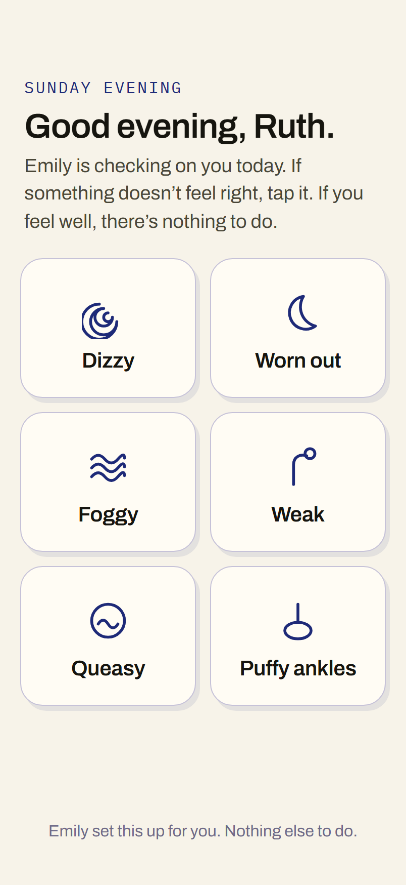
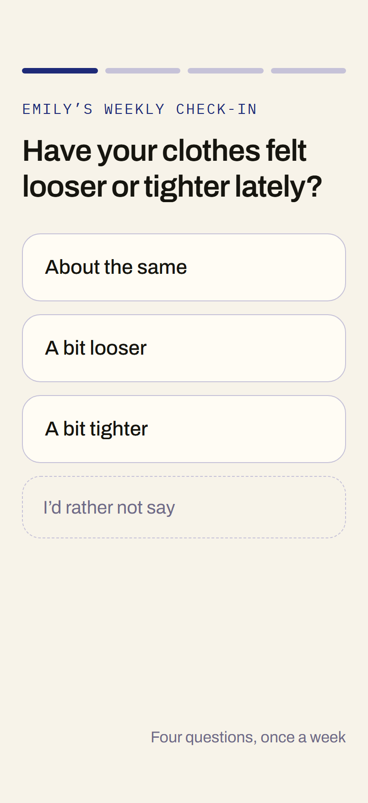
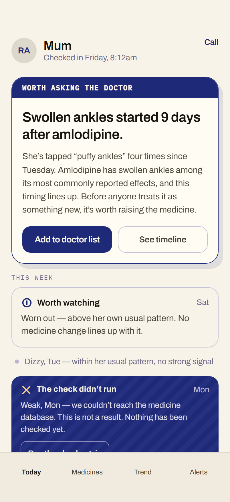
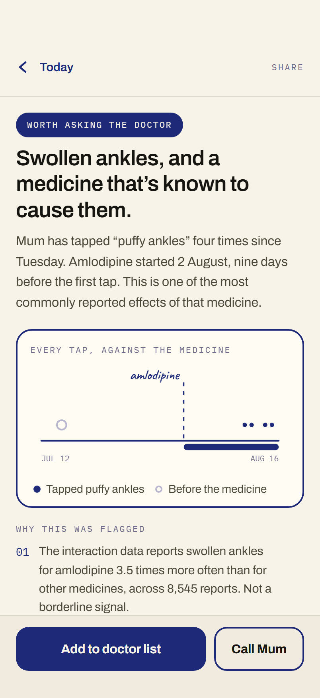
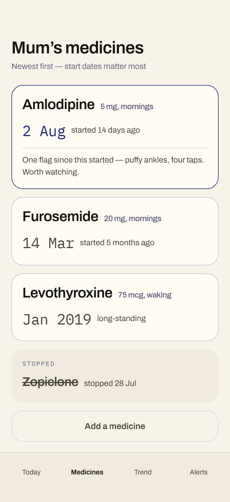
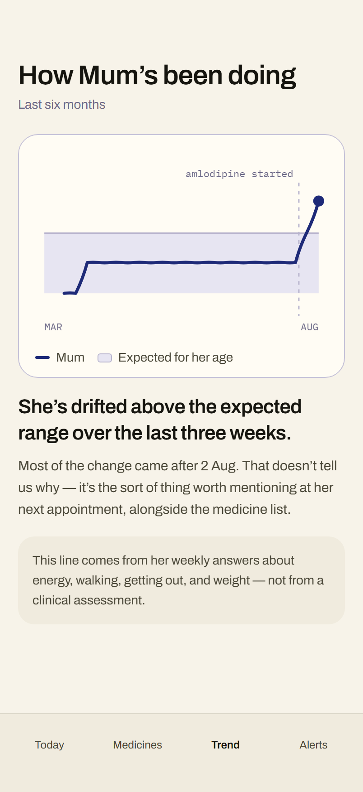
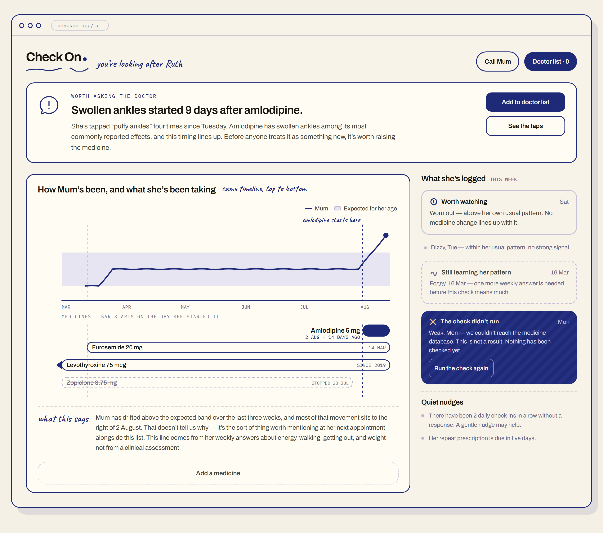

# Check On

Ruth is 78. On 2 August her doctor started her on amlodipine for blood pressure.
Nine days later her ankles were puffy.

She brought it up at her next appointment, near the end, the way people bring up
small things they don't want to make a fuss about. Nobody in that room had the
start date in front of them. Swollen ankles in a woman her age read as fluid,
fluid reads as the heart, and the heart gets a diuretic. Ruth went home on two
drugs when the first one just needed a lower dose.

There is a name for that. It's a **prescribing cascade**, and this exact one,
amlodipine to ankle swelling to a loop diuretic, is the worked example the
deprescribing literature keeps coming back to. Peripheral oedema is printed on
the FDA's own label for the drug, so none of it was hidden.

What's missing is nobody's fault. Ruth knew when her ankles started. Her daughter
Emily knew when the tablets started. The FDA's adverse event database knows the
association is real and reported thousands of times over. Those three facts never
sat in the same place at the same time, so the connection was never available to
be made.

Check On puts them in the same place.

> **Not a medical device.** This is a hackathon prototype. It does not diagnose,
> and nothing it outputs should change a medication without a clinician.

---

## Ruth's half of it

Ruth is not going to fill in a symptom diary. Almost nobody does, and asking an
older adult to type into a form every evening is a good way to get two weeks of
data and then nothing.

So her side is six buttons. She taps one if something is off. If she feels well
she does nothing at all, and doing nothing is a valid answer that the system
records as such.



Once a week she gets four questions instead. These are the frailty inputs, asked
in the plainest language we could find for them. "Have your clothes felt looser
or tighter lately?" is a weight change question. She never sees the word frailty,
and there is always a way to skip.



Six taps and four questions a week is the whole data collection burden, and most
of the rest of the design falls out of accepting that limit rather than fighting
it.

---

## Emily's half of it

Emily gets the part Ruth shouldn't have to think about. Her home screen leads
with the one thing worth raising at an appointment, and the rest of the week sits
underneath it, quieter.



Open the flag and you get the reasoning, not a score. The timeline shows every
tap against the day the medicine started, because the timing is the argument.



The medication list is sorted by start date rather than alphabetically. That
sounds like a small styling decision and it isn't. The start date is what makes a
cascade visible, so it's the largest thing on every card.



And the frailty trend, which answers a different question: is she drifting away
from what's typical for her age, whether or not any medicine explains it.



On a wide screen the two lines share one time axis, so the symptom trend and the
medication bars line up vertically and you can read the relationship directly.



---

## How it decides

Two signals, combined by plain conditional rules. They are different kinds of
thing and the code is careful not to blur them together.

| Signal | What it is |
|---|---|
| Frailty trajectory | A model **trained** on NHANES 2011–2014 that predicts the expected frailty score for a given age and sex, so we can say whether someone sits outside the usual range for their profile. |
| Medication–symptom link | A **live statistical query** against the FDA Adverse Event Reporting System via openFDA, computing a Proportional Reporting Ratio. Nothing is trained or fitted here. It is arithmetic over live counts. |

When a symptom is logged:

1. Was a medication started or changed in the last 30 days or so? If not, skip
   FAERS entirely and use only the frailty comparison.
2. If yes, query FAERS for that drug against the symptom's mapped MedDRA terms.
3. Compare her recent check-ins against the population baseline.

For Ruth, that produced a PRR of 3.5 across 8,545 reports. The pipeline is
validated against a deliberate pair: amlodipine with peripheral oedema as the
positive control, amlodipine with alopecia as the negative. Alopecia is common
enough overall to clear the case count and chi-squared bars, which is the point
of choosing it. It proves the PRR is doing the discriminating rather than small
numbers quietly failing an earlier test.

Everything lands in one of five outcomes:

| Outcome | Meaning |
|---|---|
| `MEDICATION_LINKED` | Recent medication change plus a FAERS signal. Worth raising before a new prescription. |
| `UNEXPLAINED_DEVIATION` | No medication link, but the check-ins sit outside the expected band. Worth a checkup. |
| `WITHIN_EXPECTED` | Consistent with the expected pattern. Keep watching. |
| `INSUFFICIENT_HISTORY` | Too few check-ins to compare against anything. |
| `QUERY_FAILED` | The FAERS lookup could not run. This is **not** a negative result. |

The last two exist for one reason. A case we could not evaluate must never reach
Emily looking like a case we evaluated and liked. In the interface they get their
own treatment, and neither of them is green.

---

## Where the LLM is used

One place. It turns the finished deterministic result into a plain sentence for
Emily. There is no chatbot anywhere in this app.

The frailty model, the FAERS query, the combining rules and the notification
tiering are all ordinary code. The outcome is decided before the model is ever
called, so an outage, a refusal or a rejected sentence falls back to a
deterministic template without changing a single thing the app concluded.

Every generated sentence has to pass two gates:

**Language check.** Rejects false reassurance. A no-signal FAERS result comes
back as "no strong signal detected", never as "safe". The banned list includes
*cleared*, *ruled out*, *fine*, *no risk* and *nothing to worry about*, and it
applies to hand-written interface copy as much as to generated text. A lint
script in the frontend enforces it at build time.

**Grounding check.** Rejects fabrication. If no medication changed, the sentence
may not name one or pin the symptom on medication at all. If one did change, it
may not name a different one.

Fail either gate and it regenerates with the offending text quoted back, up to
three attempts, then gives up and uses the template.

---

## Notification tiering

Built around alert fatigue. A caregiver who gets pinged for everything stops
reading the pings, so the one that mattered lands on someone who has already
learned to swipe them away.

| Event | Urgency | Push |
|---|---|---|
| Cascade flag (`MEDICATION_LINKED` / `UNEXPLAINED_DEVIATION`) | HIGH | yes |
| 2+ consecutive missed check-ins | LOW | yes |
| `INSUFFICIENT_HISTORY`, `QUERY_FAILED`, `WITHIN_EXPECTED` | none | feed only |

One missed check-in is deliberately not a notification. Ruth is allowed to have a
day where she forgets. Answering once resets the streak.

---

## What it can't do

Stated plainly, because they change how the output should be read.

The frailty baseline is cross-sectional. NHANES sees each participant once, so
the model predicts the typical score for an age and sex. It's a band to compare
against, not a forecast for one person, and it does not follow individuals over
time.

It explains very little individual variance, R² around 0.03. That's expected and
it's fine for drawing a band, but it must never be described as predicting
anyone's frailty.

Age is topcoded at 80 in NHANES, so the top of the curve is compressed. And the
frailty score is an adapted 4-of-5 Fried phenotype rather than the clinical
instrument, because the 2011–2014 cycles have no timed walk and gait speed isn't
available.

FAERS is not causal. The reports are spontaneous, unverified, duplicated and
confounded, with no denominator telling you who actually took the drug. A PRR
generates a hypothesis and nothing stronger.

Detection is weakest exactly where symptoms are vaguest. Amlodipine with
dizziness is a real labelled effect, and it scores a PRR of 1.86, under our
threshold. We would miss it. That case is the reason the language gate exists:
absence of a signal is not evidence of absence, and the app is not allowed to
imply otherwise.

---

## Layout

```
scripts/    data pipeline and model training (run once, in order)
  fetch_nhanes.py           download the NHANES cycles
  build_frailty_dataset.py  merge, clean sentinel codes, derive features
  score_frailty.py          adapted Fried frailty score
  train_baseline.py         fit and save the population baselines

backend/    decision logic
  faers_prr.py        live openFDA disproportionality
  combining.py        the five-outcome decision rules
  triage_summary.py   the single LLM call and both output gates
  notifications.py    urgency tiering
  test_*.py           test suites

api/        FastAPI service and in-memory store
frontend/   React, two separate apps under src/elder and src/caregiver
```

## Running it

```bash
pip install -r requirements.txt
```

```bash
python scripts/fetch_nhanes.py
python scripts/build_frailty_dataset.py
python scripts/score_frailty.py
python scripts/train_baseline.py
```

The NHANES download is about 33 MB and is not committed. The two fitted baselines
are, because they're a kilobyte each and the app can't compute an expected score
without them.

```bash
python backend/validate_faers.py
python backend/test_combining.py
python backend/test_triage.py --offline
python backend/test_notifications.py
```

`--offline` needs no API key. The LLM step uses Groq's OpenAI-compatible endpoint
and reads `GROQ_API_KEY` from the environment:

```bash
GROQ_API_KEY=... python backend/test_triage.py
```

The frontend has its own checks, including the copy lint that enforces the
reassurance rule:

```bash
cd frontend && npm install && npm run check
```

## Data and methods

- NHANES 2011–2012 and 2013–2014, CDC/NCHS. The only cycles carrying the grip
  strength exam.
- Fried LP, Tangen CM, Walston J, et al. *Frailty in Older Adults: Evidence for a
  Phenotype.* J Gerontol A Biol Sci Med Sci. 2001;56(3):M146–M156.
- Evans SJW, Waller PC, Davis S. *Use of proportional reporting ratios (PRRs) for
  signal generation from spontaneous adverse drug reaction reports.*
  Pharmacoepidemiol Drug Saf. 2001;10(6):483–486.
- openFDA drug/event API (FAERS).

Ruth and Emily are made up. The cascade they walked into is not, and it is
documented well enough that a lay person could look it up in an afternoon. The
gap this prototype is aimed at isn't a gap in the medical knowledge. It's that
the knowledge and the start date and the symptom are usually held by three
different people who never compare notes.
